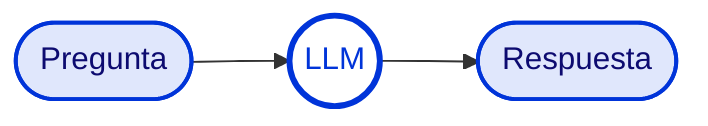
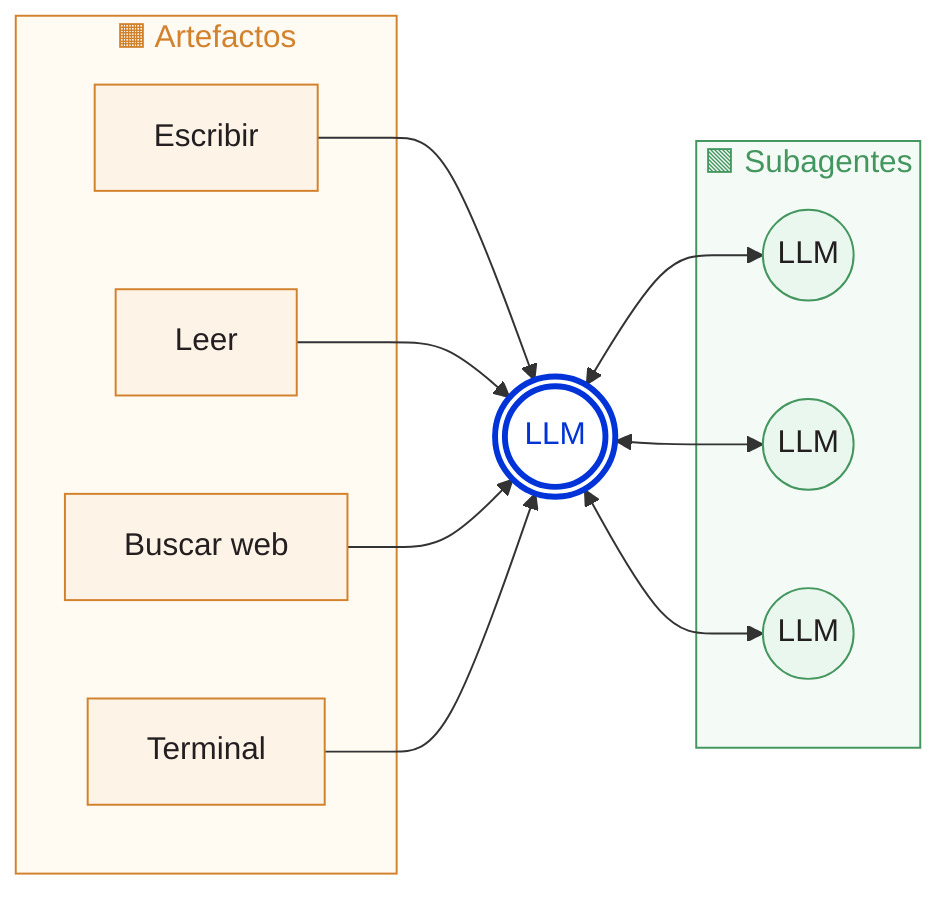
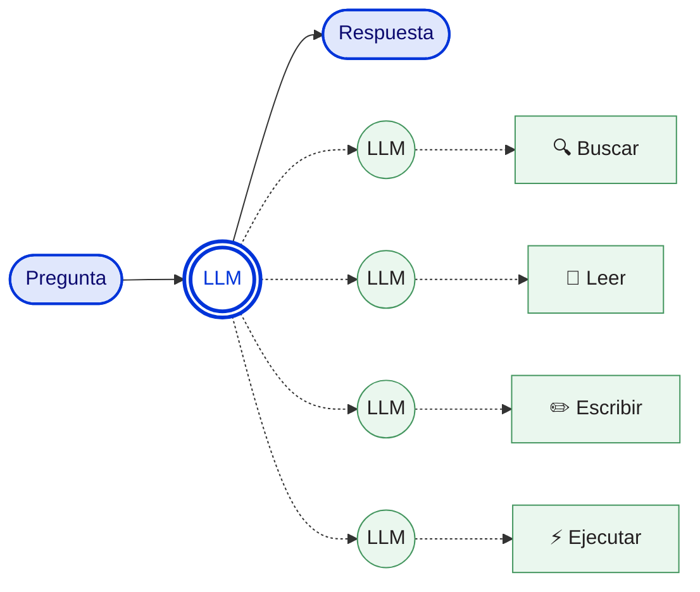
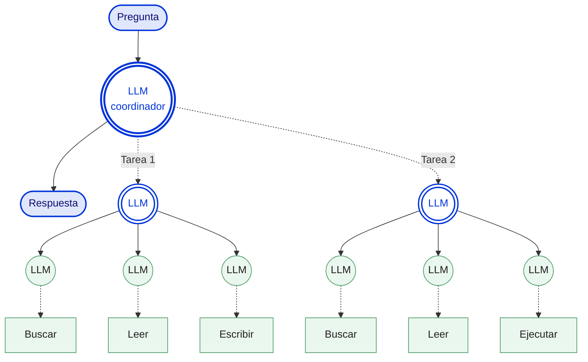

# Introducción a los agentes de IA

> Una mirada aplicada desde la economía: qué cambia cuando un LLM deja de ser un chat y pasa a ejecutar tareas.

Esta guía recoge la intuición central detrás de los **agentes de IA** y por qué se han vuelto una herramienta de trabajo —no solo de conversación— para quienes hacemos investigación en economía. La idea no es vender una tecnología, sino entender **qué hace distinto a un agente**, **cuándo conviene usarlo**, y **cómo dar los primeros pasos** sin perderse en la jerga.

---

## 1. Del chat al agente

### 1.1. Un LLM de chat: pregunta → modelo → respuesta

Lo más conocido. Un Large Language Model (LLM) recibe una instrucción en lenguaje natural y devuelve texto. Es excelente para **explicar**, **resumir**, **reformular** o **conversar**.

El modelo no toca archivos, no busca en internet, no ejecuta código. La interacción empieza y termina en la misma caja.

### 1.2. Un agente: el modelo opera con herramientas

Un agente sigue siendo un LLM al centro, pero ahora **decide pasos**, **invoca herramientas** y **trabaja sobre artefactos**. La diferencia respecto al chat no está en la calidad del razonamiento, sino en la **capacidad de ejecución**: el modelo puede leer archivos, escribir resultados, consultar la web, correr comandos y delegar subtareas a otros LLMs.

Esto cambia la naturaleza de las solicitudes que se le pueden formular:

- **Antes:** *"Explícame qué hace este código."*
- **Ahora:** *"Lee mi repositorio, ejecuta los tests, identifica por qué falla la regresión y propón una corrección."*

El agente sostiene un objetivo a lo largo de **varios pasos**, no en una sola respuesta.

### 1.3. Flujo agéntico: un objetivo, varios pasos

La pregunta entra una sola vez. La diferencia es que el sistema **planifica, usa herramientas y vuelve con evidencia** antes de responder.

### 1.4. Multiagente: dividir y coordinar

El salto a **multiagente** aparece cuando conviene repartir el trabajo: búsqueda, lectura, redacción, validación o comparación. Un agente principal **coordina**, los subagentes resuelven partes en **paralelo**, y al final se integran los resultados en una respuesta única.

Detrás de frases como *"el agente revisó 40 papers en paralelo"* no hay un único modelo gigante: hay muchos subagentes coordinados.

---

## 2. ¿Cuánto sirve esto en la práctica?

La narrativa de productividad es matizada. Dos resultados apuntan en direcciones distintas y conviene tenerlos presentes:

> 📈 **The Impact of AI on Developer Productivity: Evidence from GitHub Copilot** — [arXiv:2302.06590](https://arxiv.org/abs/2302.06590)
> En una tarea acotada (implementar un servidor HTTP en JavaScript), quienes usaron Copilot completaron el trabajo **55,8 % más rápido**.
>
> → *En tareas estándar y bien definidas, la IA acelera de forma significativa.*

> 📉 **Measuring the Impact of Early-2025 AI on Experienced Open-Source Developer Productivity** — [arXiv:2507.09089](https://arxiv.org/abs/2507.09089)
> En tareas reales sobre repositorios open-source, desarrolladores expertos usando IA tardaron **19 % más** que sin IA.
>
> → *En tareas complejas, el costo de revisar e integrar el código generado puede superar el ahorro inicial.*

**Lectura para investigación en economía.** Los agentes rinden mejor en lo **rutinario y bien especificado**: limpieza de datos, *scaffolding* de código, traducción entre Stata y Python, generación de tests, formateo de tablas. En tareas **abiertas y con criterio experto**, el cuello de botella se desplaza hacia la revisión y validación de lo que el agente produce.

---

## 3. Panorama de modelos

Tres laboratorios dominan la frontera. Los nombres y versiones cambian rápidamente; lo importante es saber dónde mirar.

| Laboratorio | Modelos de referencia | Enlace |
|---|---|---|
|  &nbsp; **Anthropic** | Claude Opus 4.7 / Sonnet 4.5 | [anthropic.com](https://www.anthropic.com/claude) |
|  &nbsp; **OpenAI** | GPT-5.4 / GPT-5.5 | [openai.com](https://openai.com/models) |
|  &nbsp; **Google** | Gemini 3.1 Pro / 3 Flash | [deepmind.google](https://deepmind.google/gemini) |

Para comparar modelos en tareas reales con preferencias humanas ciegas, la referencia colaborativa es **[LLM Arena (lmarena.ai)](https://lmarena.ai)**.

---

## 4. Servicios agénticos para programación

Los agentes para desarrollo se distribuyen como **IDEs**, **forks de VS Code** o **CLIs**. Los principales actores hoy:

| | Servicio | Descripción |
|:---:|---|---|
|  | **[Claude Code](https://claude.ai/code)** (Anthropic) | Estado del arte en desarrollo agéntico: opera sobre repositorios completos, ejecuta pruebas y usa subagentes. Disponible como CLI y como extensión para VS Code. |
|  | **[Cursor](https://cursor.com)** | Fork de VS Code con agente integrado. Permite intercambiar modelos (Claude, GPT, Gemini), iterar sobre el repositorio y automatizar edición, pruebas y correcciones. |
|  | **[Codex](https://openai.com/codex)** (OpenAI) | Entorno tipo IDE y extensión, con modelos GPT especializados en tareas de desarrollo. OpenAI fue pionera en el paradigma agéntico para programar. |
|  | **[Antigravity](https://antigravity.google/)** (Google) | Stack agéntico con experiencia de IDE/fork de VS Code, orientado a flujos donde corren modelos Gemini para programar, refactorizar y validar cambios. |
|  | **[GitHub Copilot](https://github.com/features/copilot)** | Asistente de GitHub/Microsoft integrado nativamente en VS Code. Autocompletado, chat y modo agente que edita múltiples archivos, ejecuta comandos e itera sobre el repositorio, con elección entre GPT, Claude y Gemini. |

---

## 5. Cómo empezar

**Paso 0 — Sistema operativo.** Mac (zsh), Linux (bash), o Windows (PowerShell, preferiblemente con WSL).
> *Recomendación:* Linux o Mac para mejor performance. Linux en servidor aprovecha la integración con VS Code Server.

**Paso 1 — Editor o CLI.** Opciones disponibles: Claude Code CLI, Cursor, VS Code, Antigravity, Codex IDE.
> *Recomendación:* Cursor o VS Code, y luego sumar extensiones.

**Paso 2 — Agentes vía extensión.** Si se usa VS Code o un fork (Cursor / Antigravity), conviene complementar con:
- Claude for VS Code
- Codex (OpenAI)
- Claude Code CLI en el terminal integrado

> *Recomendación final:* **Cursor + Claude Code.**

La guía paso a paso de instalación está en **[workflow/](../workflow/)**.

---

## 6. Buenas prácticas

### 6.1. Manejo del modelo

No siempre el modelo más grande es la mejor opción: en tareas simples, los modelos más capaces **sobrepiensan** y empeoran la respuesta. Hay **tres palancas** para balancear calidad y consumo de tokens:

| Palanca | Qué controla |
|---|---|
| 🧠 **Modelo** | Opus / Sonnet / Haiku (o equivalentes en GPT, Gemini). |
| ⚡ **Nivel de esfuerzo** | Presupuesto de tokens disponible para el agente y sus subagentes. |
| 💭 **Thinking mode** | Activa o desactiva la cadena de razonamiento previa a la respuesta. |

> **Regla práctica:** el mejor modelo, al máximo esfuerzo y con *thinking* activado, suele ser *overkill* — más caro, más lento, y en tareas sencillas, peor resultado. Ajustar las tres palancas a la complejidad real de la subtarea es parte del oficio de trabajar con agentes.

### 6.2. Manejo del contexto

El contexto que se entrega al agente —instrucciones, archivos relevantes, anotaciones— suele importar **más que la elección del modelo**. Es el corazón del *prompt/context engineering* ([Anthropic, 2025](https://www.anthropic.com/engineering/effective-context-engineering-for-ai-agents)).

Sin embargo, **más contexto no es mejor**: la calidad se degrada al sobrecargar la ventana. La evidencia es clara:
- [Context Rot](https://research.trychroma.com/context-rot) (Chroma, 2025) — caídas notorias al aumentar tokens de entrada.
- [Lost in the Middle](https://arxiv.org/abs/2307.03172) (Liu et al., 2023) — la información en el medio de la ventana se pierde.

> **Tensión central:** entregar el **mejor** contexto posible, en la forma **más comprimida** posible.

Tres hábitos que ayudan:
- **Una sesión por tarea.** No arrastrar conversaciones largas.
- **Higiene de ventana.** Usar `/context`, `/clear` y `/compact` en Claude Code para inspeccionar y aligerar el contexto.
- **Documentar en archivos.** Mantener instrucciones recurrentes en `README.md` o `CLAUDE.md` en lugar de repetirlas en cada prompt.

---

## 7. Extender el agente: skills, MCP, hooks, settings

A medida que el flujo de trabajo madura, el agente deja de ser una caja cerrada y se vuelve **configurable**:

- **Skills** — Instrucciones reutilizables que el agente carga bajo demanda. Estandarizan flujos recurrentes (ej. *"análisis econométrico estándar"*) y evitan repetir prompts largos.
- **MCP (Model Context Protocol)** — Estándar abierto para conectar el agente con herramientas y fuentes externas (bases de datos, Drive, Gmail, APIs, navegador) como *tools*.
- **Hooks** — Comandos shell que el *harness* ejecuta automáticamente ante eventos (antes/después de un edit, al terminar una respuesta). Útiles para *formatters*, tests y validaciones.
- **`settings.json`** — Archivo de configuración del proyecto/usuario. Define permisos, variables de entorno, hooks y MCPs activos.

Este nivel no es indispensable para arrancar, pero es donde se nota la diferencia entre un agente *out-of-the-box* y uno **calibrado al flujo de investigación**.

---

## 8. Tips para economía en VS Code

- Familiarizarse con archivos **Markdown** (`.md`): es el formato por defecto en el que escriben los LLMs. Es plano, legible y se renderiza nativamente en VS Code.
- Instalar extensiones útiles: **Office Viewer**, **PDF Viewer**.
- Instalar **Stata Enhanced** para editar archivos `.do` con mejor legibilidad.
- Instalar el kernel **nbstata** para ejecutar celdas de Stata desde notebooks.
- Identificar (con ayuda del agente) la ruta del binario `Stata-MP` y dejarla documentada en `README.md`.
- Mantener versionado con Git y agregar un `.gitignore` para bases de datos y archivos pesados.
- Crear un `README.md` por proyecto con la estructura de datos, variables clave y estrategia de identificación.

La instalación paso a paso de cada componente está cubierta en **[workflow/](../workflow/)**.

---

## Para llevar

1. Un **chat** responde; un **agente** ejecuta.
2. Los agentes aceleran lo rutinario; no resuelven mágicamente lo complejo.
3. El **contexto** que se entrega al agente importa más que la marca del modelo.
4. Empieza simple: **Cursor + Claude Code + un buen `README.md`**. Lo demás se construye con el tiempo.
