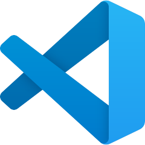

# Workflow — VS Code / Cursor + agentes de IA para Stata

El objetivo de esta guía es dejar tu entorno de trabajo listo de punta a punta para investigación, programación y análisis de datos con **Stata** asistido por agentes de IA.

Vamos a:

1. **Instalar el IDE** (VS Code o Cursor). Si usas otro fork de VS Code (por ejemplo **Antigravity**), el procedimiento es exactamente el mismo: cambia el nombre de la app, pero los pasos, atajos y extensiones son idénticos.
2. **Instalar Claude Code y Codex como extensiones** del IDE, para tener agentes de IA integrados que entiendan el contexto del proyecto.
3. **Instalar la CLI de Claude Code** (opcional), para usar Claude también desde el terminal integrado del editor.
4. **Instalar las extensiones del proyecto**: visualización de PDF, CSV, Excel, Word, `.dta` y resaltado de sintaxis de `.do`.
5. **Localizar el ejecutable de Stata** y entender sus ediciones, para poder pasarle la ruta a los agentes y evitar que la busquen en cada conversación.
6. **Instalar `nbstata`**, el kernel de Jupyter que vincula Stata al IDE y permite ejecutar código Stata con estado persistente.
7. **Configurar la Interactive Window** para ejecutar `.do` files línea a línea con `Shift+Enter`, manteniendo variables y datasets en memoria entre ejecuciones — como en un entorno interactivo de Stata.

La guía está pensada para leerse de corrido, en este orden:

1. [Instalar el editor (Cursor o VS Code)](#1-instalar-el-editor-cursor-o-vs-code)
2. [Instalar Claude Code y Codex como extensiones](#2-instalar-claude-code-y-codex-como-extensiones)
3. [Instalar Claude Code CLI (opcional)](#3-instalar-claude-code-cli-opcional)
4. [Instalar las extensiones del proyecto](#4-instalar-las-extensiones-del-proyecto)
5. [Localizar el ejecutable de Stata](#5-localizar-el-ejecutable-de-stata)
6. [Instalar `nbstata` (kernel de Stata para Jupyter)](#6-instalar-nbstata-kernel-de-stata-para-jupyter)
7. [Configurar la Interactive Window](#7-configurar-la-interactive-window)


Recursos:

- [extensions/](extensions/) — Archivos `.vsix` para extensiones no disponibles en Open VSX (instalación manual en Cursor).
- [resources/](resources/) — Archivos de ejemplo (PDF, CSV, XLSX, DOCX, `.dta`, `.do`) para probar las extensiones de visualización.

---

## 1. Instalar el editor (Cursor o VS Code)

Guía rápida para instalar **Cursor** (editor con IA integrada, fork de VS Code) o **Visual Studio Code** en Windows y macOS.

### Cuál elegir

Cursor es un **fork de VS Code**, así que se ve y funciona casi igual: las configuraciones y muchas extensiones son compatibles entre los dos. La diferencia real está en cómo cada uno integra IA y en el costo en recursos.

| Editor | Ventajas | Desventajas |
|---|---|---|
|  **Cursor** | • Agente de IA nativo más maduro que la integración por defecto de VS Code (Copilot).<br>• **Indexa el repositorio localmente** (Merkle tree incremental) → contexto del proyecto entero, no solo archivos abiertos.<br>• Ecosistema de extensiones de IA más maduro e integrado.<br>• Preconfigurado para un flujo IA-first (chat, autocompletado, agentes). | • El indexado local **consume más RAM** que VS Code; en repos grandes se nota (recomendable 16 GB mínimo, 32 GB para codebases grandes).<br>• Algunas extensiones oficiales de Microsoft no están en Open VSX (hay que instalarlas como `.vsix`).<br>• Proyecto más joven, releases más volátiles. |
|  **VS Code** | • Mantenido por **Microsoft**: proyecto más robusto, maduro y con releases predecibles.<br>• Acceso directo al **Marketplace de Microsoft**, incluidas extensiones oficiales que aún no están en Cursor / Open VSX.<br>• Menor consumo de RAM (no corre indexado semántico del repo por defecto). | • La integración de IA por defecto es **Copilot**, menos madura como agente que la de Cursor para flujos "edita-mi-repo-completo". |

> Regla rápida: si tu flujo es principalmente con IA y tu máquina aguanta la RAM, **Cursor**. Si priorizas estabilidad, ecosistema Microsoft o tienes una máquina más modesta, **VS Code** + extensiones de IA.

### Cursor

Link oficial de descarga: **https://cursor.com/download** (detecta tu sistema automáticamente)

**macOS**

1. Entra a [cursor.com/download](https://cursor.com/download).
2. Descarga el `.dmg` (elige **Apple Silicon** para M1/M2/M3/M4, o **Intel** para Macs antiguos).
3. Abre el `.dmg` y arrastra **Cursor** a la carpeta **Applications**.
4. Lanza Cursor desde Launchpad o Spotlight (`Cmd+Space` > "Cursor").
5. En el primer arranque, macOS puede preguntar si confías en la app — click **Open**.

> Para saber tu arquitectura: menú Apple > **Acerca de este Mac**. Si dice "Chip Apple M...", usa Apple Silicon.

**Windows**

1. Entra a [cursor.com/download](https://cursor.com/download).
2. Descarga el `.exe` (User Installer).
3. Ejecuta el instalador y sigue los pasos (acepta los defaults).
4. Lanza Cursor desde el menú Inicio.

### Visual Studio Code

Link oficial de descarga: **https://code.visualstudio.com/download**

**macOS**

1. Entra a [code.visualstudio.com/download](https://code.visualstudio.com/download).
2. Click en **Mac** (descarga un `.zip` universal — funciona en Intel y Apple Silicon).
3. Descomprime el `.zip` y arrastra **Visual Studio Code** a la carpeta **Applications**.
4. Lanza desde Launchpad o Spotlight (`Cmd+Space` > "Visual Studio Code").

**Windows**

1. Entra a [code.visualstudio.com/download](https://code.visualstudio.com/download).
2. Click en **Windows** > **User Installer** (recomendado — no requiere admin).
3. Ejecuta el `.exe` y sigue los pasos. Marca la casilla **Add to PATH** durante la instalación.
4. Lanza VS Code desde el menú Inicio.

> Alternativa en Windows con winget:
> ```powershell
> winget install Microsoft.VisualStudioCode
> ```

---

## 2. Instalar Claude Code y Codex como extensiones

Extensiones de **Claude Code** (Anthropic) y **Codex** (OpenAI) en tu editor, con login desde la propia app.

| Extensión | Qué es | Id |
|---|---|---|
| **Claude Code for VS Code** | Asistente de Anthropic dentro del editor (terminal + chat) | `anthropic.claude-code` |
| **Codex – OpenAI's coding agent** | Asistente de OpenAI dentro del editor | `openai.chatgpt` |

###  Claude Code for VS Code

**1. Instalar:**

1. Abre el panel **Extensions** (`Cmd+Shift+X` en macOS / `Ctrl+Shift+X` en Windows/Linux).
2. Busca `Claude Code for VS Code` (publisher **Anthropic**).
3. Click en **Install**.

**2. Abrir la extensión:**

Una vez instalada, debería aparecer en el panel **Installed** del marketplace de extensiones, y el icono de Claude  debería aparecer en la **barra lateral** del editor. Click en el icono → se abre el panel de chat de Claude Code.

> Si el icono no aparece en la barra lateral: abre la **paleta de comandos** (`Cmd+Shift+P` / `Ctrl+Shift+P`), escribe `Claude` y elige una opción como **Claude: Open Chat** o **Claude: New Agent / Session** (el nombre exacto del comando va cambiando entre versiones).

**3. Loguearse:**

1. En el panel de chat de Claude verás una opción para **Sign In**. Click ahí.
2. Se abre el navegador en `claude.ai` — autoriza la app con tu cuenta de Anthropic.
3. El navegador redirige de vuelta al editor; verás tu correo en la barra de estado y el chat queda activo.

> Para usar la extensión necesitas una cuenta de Anthropic con plan **Claude Pro** o **Max** activo (el plan gratuito no incluye acceso a Claude Code dentro del editor). Si en vez de un plan tienes una **API key** de la [Anthropic Console](https://console.anthropic.com), elige **Use API Key** en vez del flujo de navegador.

**4. Probar:** en el panel de chat escribe `hola` o `explica este archivo`. Deberías recibir una respuesta sin errores.

###  Codex – OpenAI's coding agent

**1. Instalar:**

1. Abre el panel **Extensions** (`Cmd+Shift+X` / `Ctrl+Shift+X`).
2. Busca `Codex – OpenAI's coding agent` (publisher **OpenAI**).
3. Click en **Install**.

**2. Abrir la extensión:**

Una vez instalada, debería aparecer en el panel **Installed** del marketplace, y el icono de Codex  debería aparecer en la **barra lateral** del editor. Click en el icono → se abre el panel de chat de Codex.

> Si el icono no aparece en la barra lateral: abre la **paleta de comandos** (`Cmd+Shift+P` / `Ctrl+Shift+P`), escribe `Codex` o `ChatGPT` y elige una opción como **Codex: Open** o **Codex: New Agent / Session** (el nombre exacto del comando va cambiando entre versiones).

**3. Loguearse:**

1. En el panel de chat verás una opción **Sign in with ChatGPT**. Click ahí.
2. Se abre el navegador en `chatgpt.com` — autoriza la app con tu cuenta de OpenAI.
3. El navegador redirige de vuelta al editor; quedas logeado y el chat queda activo.

> Para usar Codex necesitas una cuenta de OpenAI con plan **ChatGPT Plus**, **Pro**, **Team** o **Enterprise** activo (el plan gratuito no incluye acceso a Codex en el editor). Si solo tienes una **API key** de OpenAI, configúrala en la sección **API Key** de los settings de la extensión.

**4. Probar:** en el panel de chat pídele algo simple, por ejemplo `explica este archivo`. Deberías recibir una respuesta sin errores.

### Tip: usar los dos a la vez

Claude Code y Codex pueden convivir sin conflicto — son paneles distintos. Útil para comparar respuestas o usar cada uno donde rinde mejor (Claude suele ir mejor para refactors largos, Codex para snippets rápidos).

---

## 3. Instalar Claude Code CLI (opcional)

`claude` es la CLI oficial de Anthropic para usar Claude desde la terminal. Esta sección instala la CLI en macOS, Linux y Windows, y muestra cómo ejecutarla dentro del **terminal integrado** de VS Code o Cursor sobre este proyecto.

> **Novedad:** desde las últimas versiones, Claude Code se distribuye como **binario nativo**. Ya **no requiere Node.js / npm** — un único script de instalación deja el ejecutable `claude` en tu PATH y se auto-actualiza en segundo plano.

### Requisitos previos

- Sistema operativo soportado: **macOS 13+**, **Windows 10 1809+**, o **Linux** (Ubuntu 20.04+, Debian 10+, Fedora, Alpine 3.19+).
- Cuenta de Anthropic activa (**Claude Pro / Max / Team / Enterprise**) o **API key** de la [Console](https://console.anthropic.com). El plan gratuito de Claude.ai **no** incluye acceso a Claude Code.
- 4 GB+ de RAM y conexión a internet.

### macOS

**Opción A — Instalador nativo (recomendado):**

```bash
curl -fsSL https://claude.ai/install.sh | bash
```

**Opción B — Homebrew:**

```bash
brew install --cask claude-code
```

Verifica con:

```bash
claude --version
```

> El instalador nativo se auto-actualiza en segundo plano. Homebrew requiere actualizar manualmente con `brew upgrade claude-code`.

### Linux (Ubuntu / Debian / Fedora / Alpine)

**Opción A — Instalador nativo (recomendado):**

```bash
curl -fsSL https://claude.ai/install.sh | bash
```

**Opción B — Gestor de paquetes (apt, dnf, apk):** Anthropic publica repositorios firmados. Ver [docs oficiales](https://code.claude.com/docs/en/setup#install-with-linux-package-managers) para el detalle de cada distro.

Verifica con:

```bash
claude --version
```

### Windows

**Opción A — PowerShell (recomendado):**

```powershell
irm https://claude.ai/install.ps1 | iex
```

**Opción B — CMD:**

```batch
curl -fsSL https://claude.ai/install.cmd -o install.cmd && install.cmd && del install.cmd
```

**Opción C — WinGet:**

```powershell
winget install Anthropic.ClaudeCode
```

> En Windows nativo se recomienda tener [Git for Windows](https://git-scm.com/downloads/win) instalado para que Claude pueda usar Bash. Si no, usará PowerShell como shell.

Verifica con:

```powershell
claude --version
```

### Primer login

```bash
claude
```

1. Se abre el navegador en `claude.ai`.
2. Autoriza la app con tu cuenta.
3. El navegador redirige de vuelta a la terminal — quedas logeado.

> Si prefieres usar **API key** en vez del flujo de navegador:
> ```bash
> export ANTHROPIC_API_KEY=sk-ant-...
> ```
> (en Windows PowerShell: `$env:ANTHROPIC_API_KEY = "sk-ant-..."`)

Para cerrar sesión: `claude logout`.

### Ejecutar Claude Code en el terminal de VS Code / Cursor

1. Abre el proyecto en el editor:
   ```bash
   cursor ~/IA_Agentes_Economia
   # o
   code ~/IA_Agentes_Economia
   ```
2. Abre el **terminal integrado**: `` Ctrl+` `` o menú **Terminal > New Terminal**.
3. Verifica el directorio:
   ```bash
   pwd
   # /Users/<tu-usuario>/IA_Agentes_Economia
   ```
4. Lanza Claude Code:
   ```bash
   claude
   ```
5. Prueba con:
   ```
   > resume que hay en resources/
   ```

> Claude usa el **working directory** del terminal como contexto. Si abres el terminal dentro de `IA_Agentes_Economia`, verá todos los archivos del proyecto.

---

## 4. Instalar las extensiones del proyecto

Extensiones que usamos para visualizar PDF, CSV, Excel, Word, Stata (`.dta`) y resaltar sintaxis de `.do` files.

### Qué vamos a instalar

| Extensión | Para qué sirve | Cómo se instala |
|---|---|---|
| **Office Viewer** (`cweijan.vscode-office`) | Ver PDF, CSV, XLSX y DOCX dentro del editor | Marketplace (UI) |
| **Stata Viewer** (`diegomenares.stata-viewer`) | Previsualizar archivos `.dta` (Stata) | Marketplace (UI) |
| **Stata Enhanced** (`kylebarron.stata-enhanced`) | Syntax highlighting para `.do` / `.ado` | VSIX local (incluido en [extensions/](extensions/)) |

### Office Viewer y Stata Viewer (desde el Marketplace)

1. Abre el panel **Extensions** (`Cmd+Shift+X` en macOS / `Ctrl+Shift+X` en Windows/Linux).
2. Busca `cweijan.vscode-office` (Office Viewer) → click en **Install**.
3. Busca `diegomenares.stata-viewer` (Stata Viewer) → click en **Install**.
4. Recarga la ventana si lo pide.

### Stata Enhanced (instalación manual con `.vsix`)

**Stata Enhanced no está disponible en el Marketplace de Cursor** (ni en otros forks de VS Code que usan Open VSX, como Antigravity), porque Open VSX no la tiene publicada. Por eso la dejamos lista en este repo como archivo `.vsix` para instalación local.

**Pasos:**

1. En el explorador de archivos del editor, abre la carpeta [extensions/](extensions/) del proyecto.
2. Click derecho sobre [extensions/stata-enhanced.vsix](extensions/stata-enhanced.vsix).
3. Elige **Install Extension VSIX** (en VS Code aparece como **Install Extension VSIX**; en Cursor a veces como **Install VSIX**).
4. Espera a que confirme la instalación y recarga la ventana si lo pide.

> Alternativa desde la UI de Extensions: click en el icono `...` arriba del panel **Extensions** → **Install from VSIX...** → selecciona `extensions/stata-enhanced.vsix`.

### Verificar que quedaron instaladas

Abre los archivos de ejemplo en [resources/](resources/):

- [sample_paper.pdf](resources/sample_paper.pdf) → se ve el PDF renderizado (Office Viewer).
- [gdp_data.csv](resources/gdp_data.csv) → se ve como tabla (Office Viewer).
- [gdp_latam.xlsx](resources/gdp_latam.xlsx) → se ven las hojas (Office Viewer).
- [reporte_economia.docx](resources/reporte_economia.docx) → se ve el documento formateado (Office Viewer).
- [gdp_latam.dta](resources/gdp_latam.dta) → se ven las variables y datos (Stata Viewer).
- [analisis_gdp.do](resources/analisis_gdp.do) → palabras clave (`clear`, `use`, `regress`) coloreadas (Stata Enhanced).

> Si un archivo no abre con la vista esperada: click derecho > **Reopen Editor With...** y elige el visor correcto.

---

## 5. Localizar el ejecutable de Stata

Es **muy recomendable** identificar exactamente **dónde está instalado el ejecutable de Stata** en tu máquina y dejarlo documentado en el proyecto.

### Por qué importa

Los agentes de IA (Claude Code, Codex, etc.) necesitan saber la ruta del ejecutable para poder **correr `.do` files directamente desde el terminal** sin abrir la app gráfica. Si no se la indicas, el agente la va a buscar cada vez que abras una nueva conversación — explorando `/Applications`, `/usr/local`, `which stata`, etc. — gastando contexto y tiempo. Documentarla una sola vez ahorra ese ciclo en cada sesión.

### Rutas típicas de instalación

**macOS** — Stata se instala como bundle `.app` dentro de `/Applications/`:

| Variante | Ruta típica |
|---|---|
| Stata clásico | `/Applications/Stata/StataMP.app` · `/Applications/Stata/StataSE.app` · `/Applications/Stata/StataBE.app` |
| StataNow (subscripción) | `/Applications/StataNow/StataMP.app` (o `StataSE.app` / `StataBE.app`) |

**Linux** — normalmente bajo `/usr/local/`:

| Variante | Ruta típica |
|---|---|
| Stata 17 | `/usr/local/stata17/` |
| Stata 18 | `/usr/local/stata18/` |
| StataNow | `/usr/local/statanow/` |

### Qué suele haber adentro

En macOS, dentro de `/Applications/StataNow/` (o `/Applications/Stata/`) verás algo así:

```
StataMP.app/        ← la aplicación (GUI + ejecutables CLI dentro)
ado/                ← paquetes y comandos ado oficiales
auto.dta            ← dataset de ejemplo
docs/               ← documentación PDF
stata.lic           ← archivo de licencia
utilities/          ← utilidades auxiliares
```

Los **ejecutables reales** están dentro del bundle, en:

```
/Applications/StataNow/StataMP.app/Contents/MacOS/
├── StataMP              ← ejecutable de la GUI (la app gráfica)
├── stata-mp             ← ejecutable de terminal (CLI)
└── libstata-mp.dylib    ← librería compartida
```

En Linux es más directo: los ejecutables viven sueltos en `/usr/local/stata18/` (o la versión que tengas), por ejemplo `xstata-mp` (GUI) y `stata-mp` (CLI).

### Ediciones y por qué hay siempre dos binarios

Para cada edición de Stata se instalan **dos ejecutables**: uno con interfaz gráfica (UX) y uno de terminal (CLI).

| Binario | Tipo | Uso |
|---|---|---|
| `StataMP` / `xstata-mp` | GUI | App gráfica — Do-file Editor, ventanas, menús |
| `stata-mp` | CLI | Terminal — lo que usan los agentes de IA y los scripts |

A su vez, Stata se distribuye en **tres ediciones**, que cambian cuántos núcleos y cuánta memoria puede usar:

| Edición | Sufijo del binario | Qué significa |
|---|---|---|
| **BE** (Basic Edition) | `-be` (o `stata` a secas en algunas versiones) | Versión básica, un solo core. |
| **SE** (Standard Edition) | `-se` | Más capacidad por dataset que BE, pero sigue siendo single-threaded. |
| **MP** (Multi-Processor) | `-mp` | **Multi-Processor**: paraleliza cálculos en varios núcleos del CPU. Es la más rápida y potente, y la única que aprovecha tu hardware moderno. |

> Si tienes MP disponible, **úsala**: `-mp` significa *Multi-Processor* (no "multi parallel" — el término oficial de StataCorp es Multi-Processor). En máquinas con varios cores la diferencia de rendimiento frente a SE/BE es enorme en regresiones, bootstrap, simulaciones, etc.

Para ver qué ediciones tienes instaladas, basta con listar la carpeta:

```bash
# macOS
ls /Applications/StataNow/         # o /Applications/Stata/

# Linux
ls /usr/local/stata18/
```

Cada `.app` (macOS) o cada `xstata-*` (Linux) corresponde a una edición.

### Usar el ejecutable CLI desde el terminal

Una vez que sabes dónde está, puedes correr Stata sin abrir la app — exactamente como lo hace un agente de IA.

**macOS (StataNow MP, por ejemplo):**

```bash
# Modo batch: corre un .do file y termina (genera un .log al lado)
/Applications/StataNow/StataMP.app/Contents/MacOS/stata-mp -b do analisis.do

# Modo consola interactivo (REPL dentro de la terminal)
/Applications/StataNow/StataMP.app/Contents/MacOS/stata-mp

# Ejecutar un comando único y salir
/Applications/StataNow/StataMP.app/Contents/MacOS/stata-mp -b -e 'sysuse auto, clear; summarize'
```

**Linux (Stata 18 MP):**

```bash
/usr/local/stata18/stata-mp -b do analisis.do
```

Si quieres llamarlo simplemente como `stata-mp` desde cualquier carpeta, agrega un alias a tu shell (`~/.zshrc` o `~/.bashrc`):

```bash
alias stata-mp="/Applications/StataNow/StataMP.app/Contents/MacOS/stata-mp"
```

> Así es exactamente como un agente de IA ejecuta Stata: invoca el binario CLI con `-b do archivo.do`, lee el `.log` resultante, y te reporta los resultados. Sin esto, el agente no puede correr código Stata por su cuenta.

### Ejemplo listo para probar

En [stata-cli-example/](stata-cli-example/) dejamos un `.do` de prueba ([ejemplo_cli.do](stata-cli-example/ejemplo_cli.do)) que carga el dataset `auto`, hace un `tabulate` y corre una regresión simple. Para ejecutarlo:

```bash
cd workflow/stata-cli-example
/Applications/StataNow/StataMP.app/Contents/MacOS/stata-mp -b do ejemplo_cli.do
```

Al terminar verás un archivo [ejemplo_cli.log](stata-cli-example/ejemplo_cli.log) con todo el output (tabla de frecuencias, summary y la tabla de regresión). Si ese log aparece y termina con `Listo: ejecución terminada OK.`, tu instalación de Stata está correctamente accesible desde la terminal y los agentes podrán usarla.

### Documentar la ruta en `CLAUDE.md` (o equivalente)

**Buena práctica:** crear un archivo `CLAUDE.md` (Claude Code), `AGENTS.md` (Codex) o `.cursorrules` (Cursor) en la **raíz del proyecto**, indicándole al agente dónde está Stata. Así no tiene que buscarlo en cada conversación.

Ejemplo de `CLAUDE.md`:

```markdown
# Contexto del proyecto

## Stata

- Ejecutable CLI: `/Applications/StataNow/StataMP.app/Contents/MacOS/stata-mp`
- Edición: MP (Multi-Processor), versión StataNow
- Para correr un `.do` desde el terminal:
  `/Applications/StataNow/StataMP.app/Contents/MacOS/stata-mp -b do <archivo>.do`
- El resultado queda en un `.log` al lado del `.do`.
```

Con esto, cualquier agente que abra el repo ya sabe cómo invocar Stata — y puedes pedirle directamente "corre `analisis.do` y resúmeme la regresión final" sin que pierda tiempo descubriendo dónde está el binario.

---

## 6. Instalar `nbstata` (kernel de Stata para Jupyter)

`nbstata` es el kernel de Jupyter que permite ejecutar código **Stata** dentro de notebooks. Esta sección instala `nbstata` y `JupyterLab` de forma **aislada pero global al usuario** usando `pipx`, evitando contaminar el Python del sistema o de proyectos específicos.

### Requisitos previos

- **Stata 17 o superior** instalado localmente (incluye `pystata`, la librería que `nbstata` usa internamente).
- **Python 3.9+** disponible en el sistema.
- Saber qué **edición** de Stata tienes (`be`, `se` o `mp`).

> Antes de empezar, si tu prompt muestra `(nombre-env)`, sal del entorno virtual con `deactivate` (o `conda deactivate` si es conda).

### macOS

```bash
# 1. Instalar pipx
brew install pipx

# 2. Asegurar que pipx esté en tu PATH
pipx ensurepath
```

**Cierra y reabre la terminal** para que el PATH se actualice. Luego:

```bash
# 3. Instalar JupyterLab aislado con pipx
pipx install jupyterlab

# 4. Inyectar nbstata en el mismo venv de jupyterlab
pipx inject jupyterlab nbstata

# 5. Registrar el kernel de Stata en Jupyter (a nivel de usuario)
~/.local/pipx/venvs/jupyterlab/bin/python -m nbstata.install --user
```

> Importante: usar `--user` registra el kernel en `~/Library/Jupyter/kernels/`, que es la ubicación que **VS Code** consulta. Con `--sys-prefix` el kernel queda dentro del venv de pipx y no aparece en el selector de VS Code.

Configuración de Stata (`~/.config/nbstata/nbstata.conf`):

```ini
[nbstata]
stata_dir = /Applications/Stata
edition = se
```

### Linux (Ubuntu / Debian)

```bash
# 1. Instalar pipx
sudo apt update
sudo apt install -y pipx

# 2. Asegurar que pipx esté en tu PATH
pipx ensurepath
```

**Cierra y reabre la terminal** (o ejecuta `source ~/.bashrc`). Luego:

```bash
# 3. Instalar JupyterLab aislado con pipx
pipx install jupyterlab

# 4. Inyectar nbstata en el mismo venv de jupyterlab
pipx inject jupyterlab nbstata

# 5. Registrar el kernel de Stata en Jupyter (a nivel de usuario)
~/.local/pipx/venvs/jupyterlab/bin/python -m nbstata.install --user
```

> En otras distribuciones (Fedora, Arch, etc.) reemplaza `apt install pipx` por el gestor de paquetes correspondiente, o instálalo con `python3 -m pip install --user pipx`.

Configuración de Stata (`~/.config/nbstata/nbstata.conf`):

```ini
[nbstata]
stata_dir = /usr/local/stata18
edition = mp
```

Ajusta `stata_dir` a la ruta real de tu instalación (típicamente `/usr/local/stata17`, `/usr/local/stata18`, etc.).

### Windows

En Windows se recomienda usar **PowerShell**.

```powershell
# 1. Instalar pipx (necesita Python 3.9+ instalado desde python.org o Microsoft Store)
python -m pip install --user pipx

# 2. Asegurar que pipx esté en tu PATH
python -m pipx ensurepath
```

**Cierra y reabre PowerShell** para que el PATH se actualice. Luego:

```powershell
# 3. Instalar JupyterLab aislado con pipx
pipx install jupyterlab

# 4. Inyectar nbstata en el mismo venv de jupyterlab
pipx inject jupyterlab nbstata

# 5. Registrar el kernel de Stata en Jupyter (a nivel de usuario)
& "$env:USERPROFILE\.local\pipx\venvs\jupyterlab\Scripts\python.exe" -m nbstata.install --user
```

Configuración de Stata (`%APPDATA%\nbstata\nbstata.conf`):

```ini
[nbstata]
stata_dir = C:\Program Files\Stata18
edition = se
```

### Por qué `pipx` y no `pip` global

- **Aislado**: `pipx` crea un venv dedicado por herramienta, sin contaminar el Python del sistema ni el de tus proyectos.
- **Global al usuario**: los comandos (`jupyter`, `jupyter lab`) quedan disponibles desde cualquier carpeta.
- **Reproducible**: si algo se rompe, basta con `pipx uninstall jupyterlab` y volver a instalar — no toca nada más.
- **Mejor que el Python del sistema**: en macOS/Linux, el Python preinstalado es para uso interno del SO; mezclar paquetes ahí causa problemas de permisos y rompe dependencias del sistema.

---

## 7. Configurar la Interactive Window

Este "hack" configura un keybinding para que, estando en un archivo `.do` (o `.ado`, `.mata`), al apretar **`Shift+Enter`** la línea/selección actual se mande a la **Jupyter Interactive Window** (kernel `nbstata`), permitiendo ejecución interactiva línea a línea.

> Asume que ya tienes `nbstata` instalado (sección 6) y la extensión **Jupyter** de Microsoft instalada.

### Por qué es útil

- No tienes que copiar/pegar al terminal.
- Mantiene **estado** entre líneas (variables, datasets en memoria) porque corre en un kernel persistente.
- Permite iterar línea a línea como en un entorno interactivo.

### Dónde se edita el archivo de keybindings

El archivo es **diferente en Cursor y en VS Code**:

| Editor | macOS | Windows |
|---|---|---|
| **Cursor** | `~/Library/Application Support/Cursor/User/keybindings.json` | `%APPDATA%\Cursor\User\keybindings.json` |
| **VS Code** | `~/Library/Application Support/Code/User/keybindings.json` | `%APPDATA%\Code\User\keybindings.json` |

> En Linux la ruta es `~/.config/Cursor/User/keybindings.json` o `~/.config/Code/User/keybindings.json`.

**Cómo abrirlo desde la UI:**

1. Paleta de comandos: `Cmd+Shift+P` (macOS) / `Ctrl+Shift+P` (Windows/Linux).
2. Ejecuta: **Preferences: Open Keyboard Shortcuts (JSON)**.
3. Se abre el `keybindings.json` correcto del editor en el que estés.

### El keybinding

Pega esto dentro del array `[ ... ]` del archivo `keybindings.json`:

```json
{
    "key": "shift+enter",
    "command": "jupyter.execSelectionInteractive",
    "when": "editorTextFocus && !editorReadonly && (editorLangId == stata || resourceExtname == .do || resourceExtname == .ado || resourceExtname == .mata)"
}
```

**Qué hace cada parte:**

- `"key": "shift+enter"` — el atajo.
- `"command": "jupyter.execSelectionInteractive"` — comando de la extensión Jupyter que manda la selección (o línea actual) a la **Interactive Window**.
- `"when": ...` — condición para que el atajo se active solo en archivos Stata:
  - `editorTextFocus` → estoy escribiendo en el editor.
  - `!editorReadonly` → el archivo no es de solo lectura.
  - `editorLangId == stata` → el editor reconoce el lenguaje como Stata (lo aporta **Stata Enhanced**).
  - `resourceExtname == .do || .ado || .mata` → respaldo por extensión del archivo, por si el lenguaje no está seteado.

### Cómo usarlo

1. Abre [resources/analisis_gdp.do](resources/analisis_gdp.do) (o cualquier `.do`).
2. Pon el cursor en una línea (o selecciona varias líneas).
3. Apreta **`Shift+Enter`**.
4. La primera vez se abre la **Interactive Window** y te pide elegir kernel — selecciona **Stata (nbstata)**.
5. La línea se ejecuta en el kernel; el resultado aparece en la ventana interactiva.
6. Siguientes `Shift+Enter` reutilizan la misma sesión: las variables y datasets quedan en memoria.

> Si la primera vez no aparece **Stata (nbstata)** en la lista de kernels, revisa que `nbstata` quedó instalado (sección 6) y reinicia el editor.

